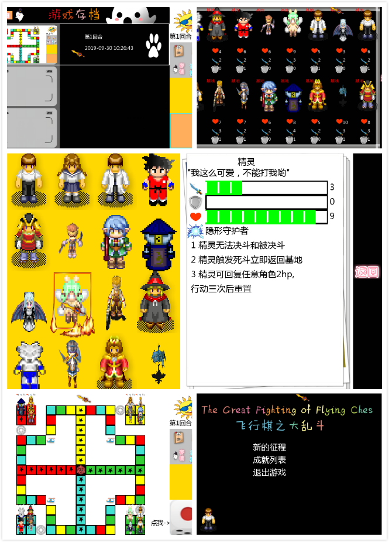
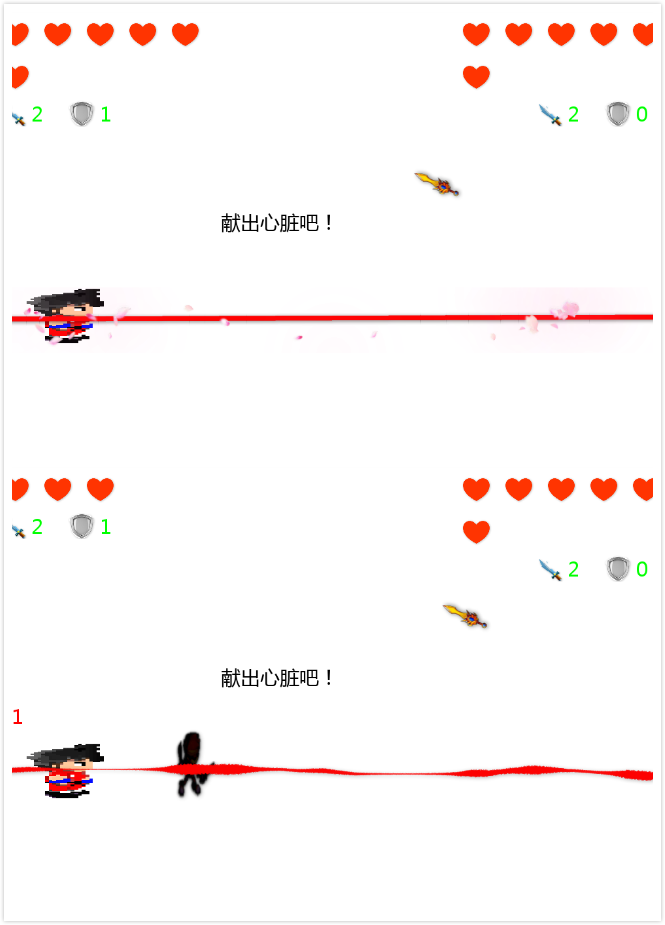

联系邮箱:gege0320@qq.com

#友情提示
    
    1  游戏支持windows平台(exe)/linux平台(直接编译python脚本运行),但不支持Macos系统(MOjave版本冲突).  
    2  操作方式几乎为鼠标操作，开启游戏后默认是全屏模式，参数可在logic-loader.py中修改 fullscreen为False,
        游戏过程中按esc快速退出，按tab查看战况。
    3  会配置python环境的同学也可以直接运行游戏脚本，详情见下方的运行说明。
    4  后续考虑加入移动端。
    
#最新版本下载地址

[百度云](https://pan.baidu.com/s/1eRPUkPcGEUdYItxQKMTXfQ)  

(提取码:rkxa) 

(20191009更新)

[坚果云](https://www.jianguoyun.com/p/DUSzAdIQprfnBxii9PsB) 

(20191009更新)

坚果云扫码下载

# 游戏介绍

    游戏名称 :  飞行棋之大乱斗   The Great Fighting of Flying Chess 
    游戏类型:   休闲娱乐/战棋策略（传统飞行棋+战棋战斗要素）
    游戏人数:   本地多人、本地人机、4个阵营
    游戏版本:   v0.2 easy_ai版 
    游戏功能介绍: 读档/存档（自动截图）、角色百科（16个角色）、
    实时战况面板、筛子投掷、角色移动跳跃动画、角色技能、角色决斗等

#游戏展示

#规则说明
    
    1 棋盘为传统飞行棋的棋盘变种，基础移动规则与飞行棋大致相同，但根据游戏特性做了些改动。
    2 游戏中共有4个阵营，每个阵营开局后随机分配到4个能力不同的角色棋子。 
    2 游戏以所有玩家一轮为一个回合，每两个回合进行昼夜更替。（时间系统）
    4 玩家每轮操作过程分为6个阶段：投筛子/选择角色移动/角色移动/使用技能或触发战斗/战斗过程/结算。
    5 先投掷筛子，根据点数选择本轮要移动的本阵营角色，仅当筛子为5或者6（飞行棋是6）可放弃移动并从基地选择角色登录战场。 （先投筛子）
    6 投掷完筛子后，选择要执行的角色，便进入角色移动阶段。 （选角色）
    7 进入角色移动阶段后，角色默认按正方向（顺时针）移动，当移动完毕后，进入跳跃结算阶段，若此时为本方颜色块，
    则跳跃到顺时针方向上的下一个同色块，若为飞行器，则跳到顺时针方向上的下一个飞行器，跳跃结束后开始进行战斗选择。
    若移动阶段停留在地图中心，则该角色完成挑战，触发女神祝福（见下面的详细说明）,离开战场。当某一个阵营的所有角色都顺利到达核心，则阵营胜利。（胜利条件）
    8 战斗选择阶段，若有两个棋子位置重叠，则直接触发死斗，若无重叠，角色可选择对附近一格内的其他角色发动决斗或者使用技能，也可以不行动待机。 (根据状况进行策略行为)
    9 触发死斗后，两名角色必须战斗到一方血量归0,第五回合后，每个角色行动后失去一点hp。如果正常发起决斗，则双方角色仅互相进攻一回合。 (行为结算)
    10 战斗结束后，系统结算所有角色状态，血量归零的角色会回到基地并重置为初始状态。
    11 并进入下一轮，更换阵营操作权。 (本轮结算)

#角色介绍

    名称 攻击/防御/血量 特技
    程序员 2/1/6  逆向思维(主动),每次移动后，可修改移动方向（逆时针）,
    小甜心 2/1/7 无敌可爱,决斗或死斗过程中,每次受到伤害结算,前百分之20概率,免疫本次伤害,
    科学家 2/1/5 伟大发明, 对自己造成1点伤害, 然后移动到随机位置,
    孩子王 2/1/6 被动:幸福追求, 与怪兽决斗时, 攻击力*5,
    武士  3/1/8  被动:决斗大师, 决斗或死斗中,永远先手攻击,
    刺客 2/0/6  被动：心眼爆破, 刺客的攻击无视,防御力,
    猎人 2/0/6  狙击,对战场上任意角色,造成1点伤害,行动两次,后重置技能,
    僵尸 4/1/8  被动:见不得光,僵尸在白天无法行动,
    吸血鬼 2/0/3 被动:血源秘法,每次行动结束后,增加自身血量1,
    精灵  3/0/9  隐形守护者,1 精灵无法决斗和被决斗,2 精灵触发死斗立即返回基地,3 精灵可回复任意角色2hp,,行动三次后重置,
    屠夫 3/1/7  飞刀,屠夫使用飞刀对直线上所有角色造成2,点伤害，飞刀共两把，返回基地后重置,
    女巫 2/0/4  死亡诅咒,对战场上随机角色(包含自己),造成1～3点伤害,
    狼人 3/0/8  被动:黑夜王者,夜晚攻击力翻倍,
    骑士 2/1/7  战术迂回,骑士发起决斗后，,阵营额外行动一次,
    国王 2/0/5  被动:权利庇护,国王受到任何伤害单次结算不大于1,
    怪兽 3/1/10 被动:天生仇恨,被动决斗时防御翻倍

#女神祝福
     
    1 我方一角色攻击力永久+2
    2 阵营所有英雄血量+2
    3 立即对场上一个指定角色造成2点伤害.

#运行说明
    
    游戏基于纯pygame引擎开发，直接在根目录下运行命令即可开启游戏:
       python main.py 
    提示:需要python3.4+环境.
    (后续会增加win-exe版本和apk版本)

#作者的话

    设计开发这个游戏demo花了我三个月的业余时间，本来想把他做得更好，找美工、自己配音、然后移植到商用游戏引擎上。
    但一个人的精力是有限的，这个游戏设计的初衷也仅仅是为了家庭聚会娱乐，并不是为了商业化，所以我决定把他开源了。
    
    代码质量和游戏创意虽然不是很好，但至少这个游戏的功能、流程是完成的，走通的，对于我个人来说已经是一个大突破。
    用网上找到素材和部分自己的手绘，加上自己的一些脑洞，做出来的各种五毛钱动画特效，自己看着也觉得十分有趣，成就感满满.
    
    希望感兴趣的人一起完善下这个游戏，或者提点意见，或者随便吐槽下都可以～

#开发计划
    
    1 目前预估在10月底推出AI，具体进度视本人上班划水能力而定。(20190930)
    2 easy_ai已于 20191009开发完成，现发布测试  (20191009)
    3 后续进行AI强化、新角色加入、用户体验强化、配音添加、视觉优化等
    4 可能会推出相关的主题网站，也期待喜欢游戏的小伙伴一起加入！
    

#更新日志
    
    v0.2 
    1 添加easy_ai，现在支持本地人机对战，系统自动根据玩家数量添加AI直到4个阵营
    2 修复怪兽决斗过程中防御数值未正常显示的bug
    
#关于合作开发计划
    
    1 AI的设计，主要是stage1(选择移动角色)和stage3(选择移动后的行为策略),在对应的代码模块中要做了注释，想要参与设计的小伙伴可以写下
    自己的方案并提交。 [in logic-s_game_stage1.py and logic-s_game_stage3.py]
    2 关于角色设计，其实很多角色的设计都过于保守，包括数值和特性，主要是一个人开发精力不足，所以做了很多简化。有好的想法的小伙伴可以直接留言。
    3 是否有加入暴击机制的必要
    4 其他方面的意见都可以留言  
